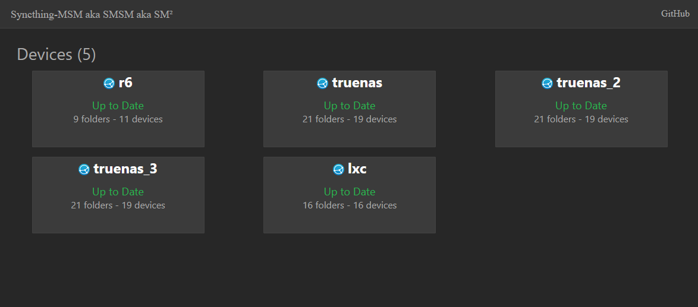
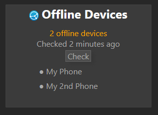

# sm²
Syncthing Multi Server Monitor
stylized as sm² (or sm2 for convenience)


## The goal:
Monitor multiple syncthing instances while using as little diskspace(docker image size) & memory while doing it.

This affected the following parts:
- no use of an already made syncthing library (this also allows sm2 to only ever call GET endpoinds)
- no fancy ui -> lower diskspace, loadtime ( I also could not make a fancy ui if I tried)
- no logging exept printing to console logging increased the ram usage by ~50%


This project was made with very little sleep so there will be typo's, missed conventions, ... let me know when you see anything.
Any feedback is appreciated.

# features
- Sync status of each device (threaded for performance)
- List of folders with local changes (if there are any)
- List pending devices or folders (if there are any)
- Display of errors (if there are any)
- API for monitoring (I use changedetecion.io)
- Small footprint: docker image ~65MB, ram usage 34MB (goal is to lower this back down)
- Responsive UI that works on mobile devices
- Configure devices with environment variables or with a json file 
- handling devices going offline and returning (phones, laptops, ...)

# Screenshots

<div>

</div>
<div>


</div>

Usage:
add your syncthing devices via a json file or env variables:

json:
``` 
    [
    {"name" : "device1", 
    "url": "10.0.0.1:8384",
    "api_key": "API_KEY" },
    {"name" : "device2", 
    "url": "10.0.0.2:8384",
    "api_key": "API_KEY" }
    ]
```
env variables:
```
      - DEV_NAME_1=device1
      - DEV_URL_1=10.0.0.1:8384
      - DEV_API_KEY_1=API_KEY
      - DEV_NAME_2=device2
      - DEV_URL_2=10.0.0.2:8384
      - DEV_API_KEY_2=API_KEY
```      

The default protocol used is http if you require https for a device you'll need to add it to the url


# docker-compose example
You can mix both env variables & the device file
## with env variables
```
  sm2:
    image: nwarelab/sm2:latest
    container_name: sm2
    restart: always
    environment:
      - DEV_NAME_1=device1
      - DEV_URL_1=10.0.0.1:8384
      - DEV_API_KEY_1=API_KEY
      - DEV_NAME_2=device2
      - DEV_URL_2=10.0.0.2:8384
      - DEV_API_KEY_2=API_KEY
    ports:
      - 8456:8456
```
## with device files
```
  sm2:
    image: nwarelab/sm2:latest
    container_name: sm2
    restart: always
    ports:
      - 8456:8456
    volumes:
      - ./device_list.json:/app/device_list.json
```

## data reporting
By default the application reports some data back for usage statistics.
This is to follow the amount  installs and which versions users are running, ...
sm2 will always report what data its sending back.
example of the data
```
{'ts': 1738466626.1446433, 'hostname': '5251dae16210', 'dev': 1, 'v': '0.1'}
```
currently this data includes: 
- docker container id (this is to keep instances apart in the stats)
- amount off devices configured (just the amount)
- application version

tl:dr;

sm² has basic reporting for some statistics. __no personal data__ will ever be sent over, if you want to disable this reporting add the following environment variable. _I would like it if you didn't because I like stats, but I fully understand if you don't_
```
- DISABLE_REPORTING=true
```
# Exta settings
| env variable                            | what it does                        | default value |
|-----------------------------------------|-------------------------------------|-------------- |
| DISABLE_OFFLINE_DEVICE_BACKGROUND_RETRY | disable the retrying off offline devices in background | false         |
| DISABLE_REPORTING | disable the information reporting | false |

`DISABLE_OFFLINE_DEVICE_BACKGROUND_RETRY`
recheck offline devices in the background every hour.

# FAQ 
Q: How would I add devices that are on different networks? 
A: I use vpn's to connect my multiple locations common options are tailscale, netbird, twingate, ... (not endorsements)

# TODO's
- check offline devices in background
- gotify for notifications ?
- figure out healthcheck that has less cpu impact

